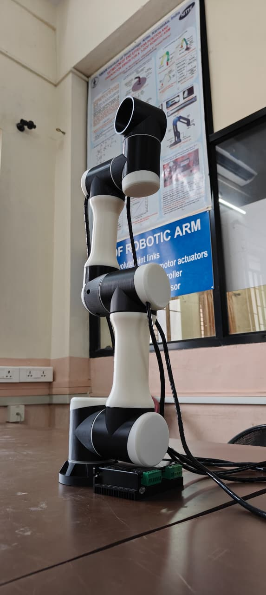
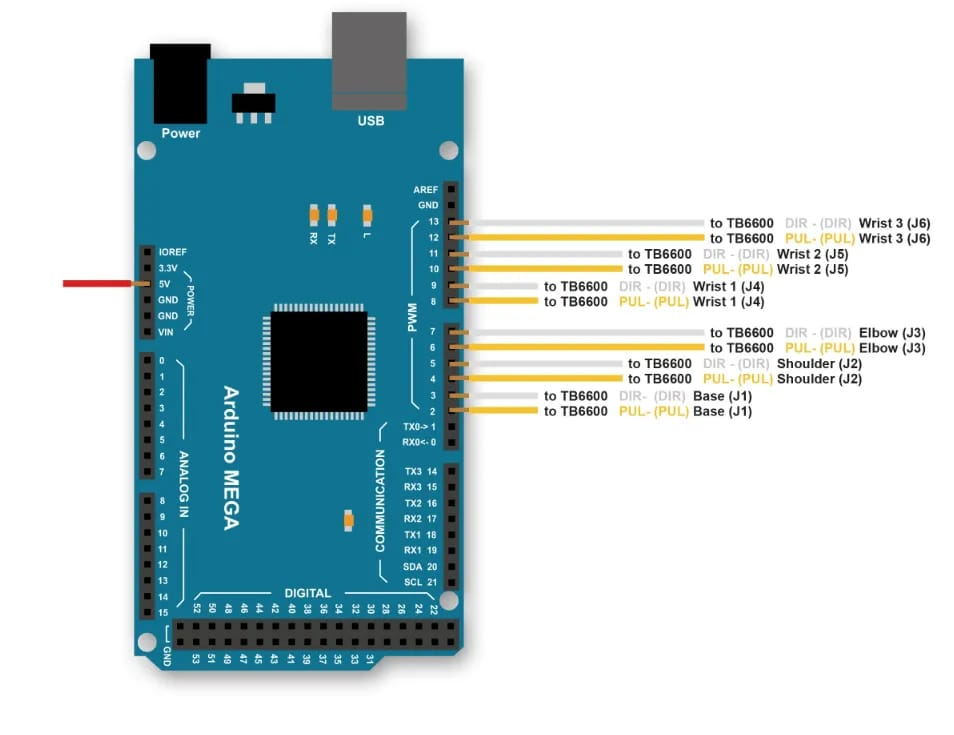

# 🦾 6-DOF Robot Arm Controller

> Stepper-motor controller for the **EB-15 Robotic Arm** by [Toolbox Robotics](https://toolboxrobotics.com/robotic-arm-eb15), driven by an **Arduino Mega** + **TB6600** drivers and operated from a **Python / Tkinter GUI** over USB serial.

<p align="center">
  
</p>

---

## 📋 Table of Contents

- [Overview](#overview)
- [Hardware](#hardware)
- [Wiring / Pin Map](#wiring--pin-map)
- [Arduino Firmware](#arduino-firmware)
- [Python GUI](#python-gui)
- [Serial Protocol](#serial-protocol)
- [Getting Started](#getting-started)
- [Sequence Recording & Playback](#sequence-recording--playback)
- [Project Structure](#project-structure)
- [License](#license)

---

## Overview

This project provides full open-loop stepper control for a 6-axis robotic arm. The Arduino Mega drives six TB6600 stepper driver modules (one per joint). A desktop Python application connects over USB serial and lets you:

- Move individual joints by angle (°) with a slider or typed value
- Move all six joints **simultaneously** with interleaved stepping
- Set a custom home position and return to it at any time
- Record, export, import, and play back multi-step motion sequences
- Stop any single joint or emergency-stop all joints instantly

---

## Hardware

| Component | Details |
|-----------|---------|
| Robotic Arm | [EB-15 by Toolbox Robotics](https://toolboxrobotics.com/robotic-arm-eb15) |
| Microcontroller | Arduino Mega 2560 |
| Stepper Drivers | 6× TB6600 (one per joint) |
| Stepper Motors | 6× (200 steps/rev, 1/16 microstepping) |
| Gear Ratio | 38.4 : 1 per joint |
| Baud Rate | 115200 |

**Steps per degree** (calculated from above):

```
steps_per_degree = (200 × 16 × 38.4) / 360 ≈ 341.33 steps/°
```

---

## Wiring / Pin Map

<p align="center">
  
</p>

Each TB6600 driver needs two signal lines from the Arduino — **DIR** (direction) and **PUL** (pulse/step).

| Joint | Name | DIR Pin | PUL Pin |
|-------|------|---------|---------|
| J1 | Base | 3 | 2 |
| J2 | Shoulder | 5 | 4 |
| J3 | Elbow | 7 | 6 |
| J4 | Wrist Pitch | 9 | 8 |
| J5 | Wrist Roll | 11 | 10 |
| J6 | Gripper | 13 | 12 |

> All DIR pins shown in **amber**, all PUL pins shown in **yellow/green** in the wiring diagram above.

---

## Arduino Firmware

**File:** `robot_arm_mega.ino`

Flash this sketch to your Arduino Mega before using the GUI.

### What it does

- Initialises all 12 GPIO pins (DIR + PUL for each joint) as outputs
- Listens for serial commands at **115200 baud**
- Moves joints by pulse-stepping the TB6600 drivers
- Supports per-joint stop (`S`) and universal emergency stop (`X`)
- For multi-joint moves, uses **interleaved stepping** so all joints start and pulse together, with faster-finishing joints dropping out cleanly

### Flash instructions

1. Open `robot_arm_mega.ino` in the [Arduino IDE](https://www.arduino.cc/en/software)
2. Select **Board → Arduino Mega or Mega 2560**
3. Select the correct COM / tty port
4. Click **Upload**

---

## Python GUI

**File:** `robot_arm_gui.py`

### Requirements

```bash
pip install pyserial
```

Python 3.8 + is required. Tkinter ships with standard Python on Windows and macOS; on Linux install with:

```bash
sudo apt install python3-tk
```

### Run

```bash
python robot_arm_gui.py
```

### GUI Features

| Feature | Description |
|---------|-------------|
| Port selector | Auto-detects available COM / tty ports with a refresh button |
| Connect / Disconnect | Opens or closes the serial connection at 115200 baud |
| Per-joint sliders | Drag to set target angle (−180° → +180°) |
| Angle entry box | Type an exact angle and press **Enter** or click **SEND** |
| Per-joint speed | Individual slow ↔ fast slider per joint (200 – 3000 µs pulse delay) |
| Master speed | Single slider that overrides all joint speeds at once |
| STOP (per joint) | Halts a single joint mid-move |
| ⬛ STOP ALL | Emergency stop — sends `X` command, halts everything immediately |
| SET HOME | Marks the current position as 0° for all joints |
| GO HOME | Sends all joints back to the saved home position |
| SEND ALL | Moves all joints simultaneously to their currently shown angles |
| CONNECTIONS popup | Shows the full Arduino pin map in a side window |
| Log panel | Timestamped colour-coded log of every action and Arduino reply |

---

## Serial Protocol

All commands end with `\n`. The Arduino replies over the same serial port.

| Command | Format | Example | Description |
|---------|--------|---------|-------------|
| Single joint move | `J<joint>,<steps>,<speed_us>` | `J0,1024,800` | Move joint 0 by 1024 steps at 800 µs/step |
| Multi joint move | `M<s0>,<s1>,<s2>,<s3>,<s4>,<s5>,<speed_us>` | `M512,0,-256,0,128,0,600` | Move all joints simultaneously |
| Stop joint | `S<joint>` | `S2` | Stop joint 2 immediately |
| Stop all | `X` | `X` | Emergency stop — all joints halt |

### Arduino replies

| Reply | Meaning |
|-------|---------|
| `READY` | Firmware started successfully |
| `OK J<n> steps=… spd=…` | Single joint move completed |
| `OK M steps=… spd=…` | Multi joint move completed |
| `STOPPED J<n>` | Joint stopped mid-move by `S` command |
| `STOPPED ALL` | All joints stopped by `X` command |

> **Speed note:** `speed_us` is the microsecond delay between each pulse edge. Lower = faster. Valid range: 100 – 5000 µs (clamped by firmware).

---

## Getting Started

1. **Wire** the TB6600 drivers to the Arduino Mega as per the pin map above
2. **Flash** `robot_arm_mega.ino` to the Arduino Mega
3. **Power** the stepper drivers (check TB6600 input voltage for your motors)
4. **Install Python dependencies:** `pip install pyserial`
5. **Run the GUI:** `python robot_arm_gui.py`
6. **Select the port** from the dropdown and click **CONNECT**
7. The status indicator turns blue and the log shows *"Connected to COMx @ 115200 baud"*
8. Move sliders or type angles and click **SEND** / **SEND ALL**

---

## Sequence Recording & Playback

The GUI includes a simple teach-and-playback system:

1. Move the arm to a desired pose
2. Click **＋ ADD STEP** — the current angles and speeds are saved
3. Repeat for each waypoint
4. Click **▶ START** to play the full sequence back over serial
5. Use **EXPORT FILE** to save the sequence as a `.json` file
6. Use **IMPORT FILE** to reload a saved sequence later

Sequences are stored as plain JSON and can be edited by hand:

```json
{
  "sequence": [
    {
      "angles": [0.0, 45.0, -30.0, 0.0, 0.0, 0.0],
      "speeds": [800, 800, 800, 800, 800, 800]
    }
  ]
}
```

---

## Project Structure

```
robot-arm/
├── robot_arm_mega.ino   # Arduino Mega firmware
├── robot_arm_gui.py     # Python / Tkinter desktop controller
└── README.md
```

---

## License

This project is released for personal and educational use. The EB-15 robotic arm design is the property of [Toolbox Robotics](https://toolboxrobotics.com/robotic-arm-eb15).
