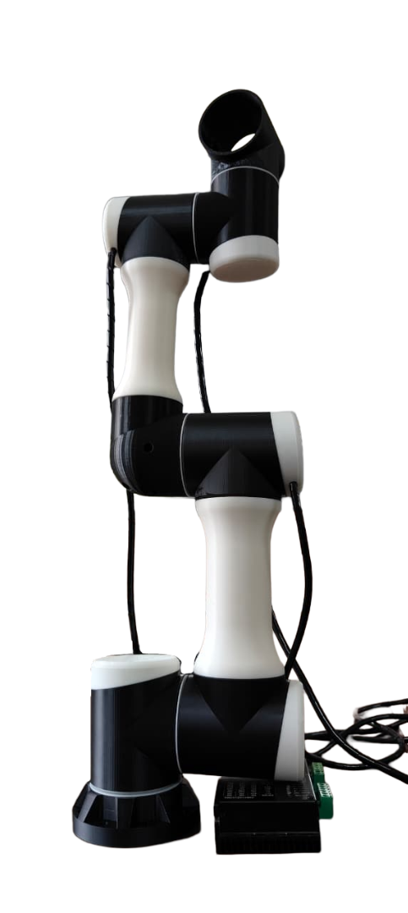
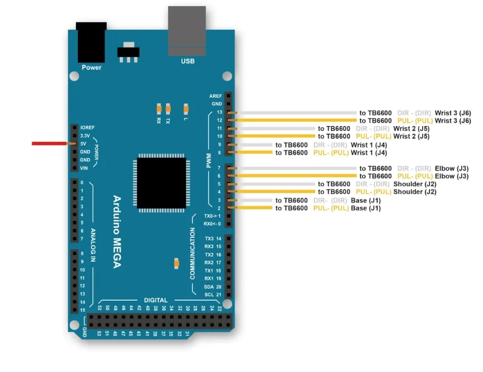
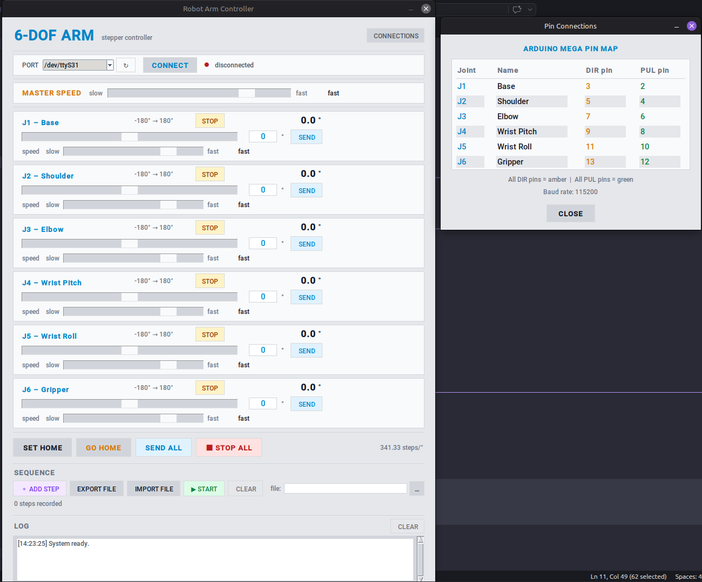

# 6-DOF Robot Arm Controller

> Stepper-motor controller for the **EB-15 Robotic Arm** by [Toolbox Robotics](https://toolboxrobotics.com/robotic-arm-eb15), driven by an **Arduino Mega** + **TB6600** drivers and operated from a **Python / Tkinter GUI** over USB serial.

<div style="width:600px; height:400px; border:1px dashed #555; display:flex; align-items:center; justify-content:center;">
  
</div>

---

## Table of Contents

- [Overview](#overview)
- [Hardware](#hardware)
- [Wiring / Pin Map](#wiring--pin-map)
- [Arduino Firmware](#arduino-firmware)
- [Python GUI](#python-gui)
- [Serial Protocol](#serial-protocol)
- [Getting Started](#getting-started)
- [Sequence Recording & Playback](#sequence-recording--playback)
- [License](#license)

---

## Overview

This project provides full open-loop stepper control for a 6-axis robotic arm. The Arduino Mega drives six TB6600 stepper driver modules (one per joint). A desktop Python application connects over USB serial and lets you:

- Move individual joints
- Move all six joints simultaneously 
- Set a custom home position and return 
- Record, export, import, and play back 
---

## Hardware

| Component       | Details                                                                   |
| ---------------- | -------------------------------------------------------------------------- |
| Robotic Arm      | [EB-15 by Toolbox Robotics](https://toolboxrobotics.com/robotic-arm-eb15) |
| Microcontroller  | Arduino Mega integrated with ESP8266                                      |
| Stepper Drivers  | 6x TB6600                                                  |
| Stepper Motors   | 3x Nema17 60mm and 3x Nema17 34mm                                          |
| Gear Ratio       | 38.4 : 1 per joint                                                         |
| Microstepping    | 1/16 (set on the TB6600 DIP switches)                                     |
| Baud Rate        | 115200                                                                     |

**Steps per degree** (calculated from the above, and matching the constant in `robot_arm_gui.py`):

```
STEPS_PER_DEGREE = (200 * 16 * 38.4) / 360 = 341.33 steps/deg
```

---

## Wiring / Pin Map

<!-- Wiring diagram / driver connections -->


| Joint | Name        | DIR Pin | PUL Pin |
| ----- | ----------- | ------- | ------- |
| J1    | Base        | 3       | 2       |
| J2    | Shoulder    | 5       | 4       |
| J3    | Elbow       | 7       | 6       |
| J4    | Wrist Pitch | 9       | 8       |
| J5    | Wrist Roll  | 11      | 10      |
| J6    | Gripper     | 13      | 12      |

---

## Arduino Firmware

**File:** `robot_arm_mega.ino`

Flash this sketch to your Arduino Mega before using the GUI.

### What it does

- Initializes all 12 GPIO pins (DIR + PUL for each joint)
- Listens for serial commands at **115200 baud**, 
- Moves joints by pulse-stepping the TB6600 drivers, with a 5 microsecond DIR-line settle delay before stepping starts
- Clamps any received `speed_us` value to the 100-5000 microsecond range regardless of what the GUI sends

### Flash instructions

1. Open `robot_arm_mega.ino` in the [Arduino IDE](https://www.arduino.cc/en/software)
2. Select **Board -> Arduino Mega or Mega 2560**
3. Select the COM / tty port
4. Click **Upload**

---

## Python GUI

**File:** `robot_arm_gui.py`

<div style="width:600px; height:400px; border:1px dashed #555; display:flex; align-items:center; justify-content:center;">
  
</div>

### Requirements

```
pip install pyserial
```

- Python 3.8+ is required.
- Tkinter ships with standard Python on Windows and macOS; on Linux install it with:

```
sudo apt install python3-tk
```

- The script calls `ctypes.windll.shcore.SetProcessDpiAwareness(1)` at startup to fix blurry scaling on high-DPI displays. This call is **Windows-only** -- see [Known Limitations](#known-limitations) if you plan to run the GUI on Linux or macOS.

### Run

```
python robot_arm_gui.py
```

### GUI Features

| Feature              | Description                                                              |
| --------------------- | -------------------------------------------------------------------------- |
| Port selector         | Lists available COM / tty ports with a refresh button                     |
| Connect / Disconnect  | Opens or closes the serial  at 115200 baud (120s read timeout) |
| Per-joint sliders     | Drag to set target angle (-180 deg to +180 deg)                          |
| Angle entry box       | Type an exact angle and press **Enter**, or click **SEND**               |
| Per-joint speed       | Individual slow-to-fast slider per joint (200-3000 microsecond pulse delay) |
| Master speed          | Single slider that overrides all six joint speed sliders at once          |
| STOP (per joint)      | Halts a single joint mid-move by setting a stop flag and sending `S<joint>` |
| STOP ALL              | Emergency stop -- sends `X`, halts every joint immediately                |
| SET HOME              | Marks the current motor position as 0 deg for all joints                  |
| GO HOME               | Sends all joints back to the saved home position                          |
| SEND ALL              | Moves all joints simultaneously to their currently shown angles           |
| S popup     | Shows the full Arduino pin map in a side window                           |
| Log panel             | Timestamped, color-coded log of every action and Arduino reply            |

Angle values are tracked absolutely (in steps) on the Python side via `self.motor_steps`, and only the *delta* between the current position and the target is sent to the Arduino for each move.

---

## Serial Protocol

All commands end with `\n`. The Arduino replies over the same serial port.

| Command            | Format                                       | Example                    | Description                                |
| -------------------- | ----------------------------------------------- | ----------------------------- | --------------------------------------------- |
| Single joint move   | `J<joint>,<steps>,<speed_us>`                  | `J0,1024,800`                | Move joint 0 by 1024 steps at 800 microsecond/step |
| Multi joint move    | `M<s0>,<s1>,<s2>,<s3>,<s4>,<s5>,<speed_us>`    | `M512,0,-256,0,128,0,600`    | Move all joints simultaneously               |
| Stop joint          | `S<joint>`                                     | `S2`                          | Stop joint 2 immediately                     |
| Stop all            | `X`                                             | `X`                            | Emergency stop -- all joints halt            |

Joint indices are 0-based (`J0`-`J5`), matching the array order in the pin map above (J0 = Base ... J5 = Gripper).

### Arduino replies

| Reply                    | Meaning                                |
| -------------------------- | ----------------------------------------- |
| `READY`                   | Firmware started successfully            |
| `OK J<n> steps=... spd=...` | Single joint move completed              |
| `OK M steps=... spd=...`  | Multi joint move completed               |
| `STOPPED J<n>`            | Joint stopped mid-move by `S` command    |
| `STOPPED ALL`              | All joints stopped by `X` command        |

> **Speed note:** `speed_us` is the microsecond delay between each pulse edge. Lower = faster. The firmware clamps every received value to 100-5000 microseconds no matter what is sent.

---

## Getting Started

1. **Wire** the TB6600 drivers to the Arduino Mega as per the pin map above
2. **Flash** `robot_arm_mega.ino` to the Arduino Mega
3. **Power** the stepper drivers (check TB6600 input voltage for your motors)
4. **Install Python dependencies:** `pip install pyserial`
5. **Run the GUI:** `python robot_arm_gui.py`
6. **Select the port** from the dropdown and click **CONNECT**
7. The status indicator turns solid and the log shows "Connected to COMx @ 115200 baud"
8. Move sliders or type angles and click **SEND** / **SEND ALL**

---

## Sequence Recording & Playback

The GUI includes a simple teach-and-playback system:

1. Move the arm to a desired pose
2. Click **+ ADD STEP** -- the current angles and per-joint speeds are saved
3. Repeat for each waypoint
4. Click **START** to play the full sequence back over serial
5. Use **EXPORT FILE** to save the sequence as a `.json` file
6. Use **IMPORT FILE** to reload a saved sequence later

During playback, each step is sent as a single `M` command, using the *slowest* of the six per-joint speeds saved for that step so all joints arrive together.

Sequences are stored as plain JSON and can be edited by hand:

```json
{
  "sequence": [
    {
      "angles": [0.0, 45.0, -30.0, 0.0, 0.0, 0.0],
      "speeds": [800, 800, 800, 800, 800, 800]
    }
  ]
}
```

---

## License

This project is released for personal and educational use. The EB-15 robotic arm design is the property of [Toolbox Robotics](https://toolboxrobotics.com/robotic-arm-eb15).
